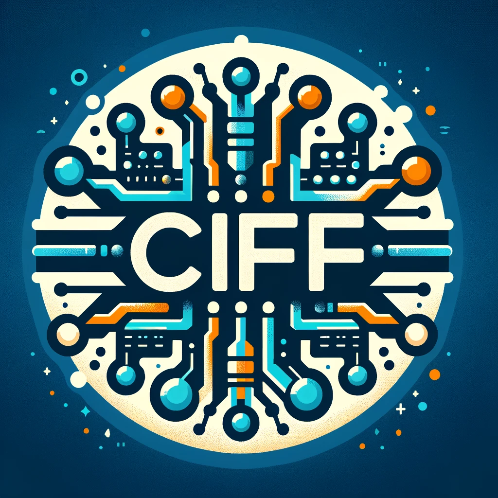

# CIFF Hub
Hosting some useful CIFFs 

### ESPLADE

> Lassance, Carlos, and Stéphane Clinchant. "An efficiency study for splade models." Proceedings of the 45th International ACM SIGIR Conference on Research and Development in Information Retrieval. 2022.

| Name | Description | MD5 | Download |
|:-----------|:--------------|-----|:---------|
| ESPLADE   | `efficient-splade-V-large-doc` reordered w/ BP  | `a6ecd8412e85b3e168dce983cede9ec5` | [https://storage.googleapis.com/ciff-hub/esplade/ciff/bp-msmarco-passage-esplade-quantized.ciff](https://storage.googleapis.com/ciff-hub/esplade/ciff/bp-msmarco-passage-esplade-quantized.ciff)|

### CSV

> Yu, Puxuan, Antonio Mallia, and Matthias Petri. "Improved Learned Sparse Retrieval with Corpus-Specific Vocabularies." arXiv preprint arXiv:2401.06703 (2024).

| Name | Description | MD5 | Download |
|:-----------|:--------------|-----|:---------|
| CSV-30k   | `csv-30k` reordered w/ BP  | `8575bda881a16faffe8b12915b75aa42` | [https://storage.googleapis.com/ciff-hub/csv-30k/ciff/bp-csv-30k.ciff](https://storage.googleapis.com/ciff-hub/csv-30k/ciff/bp-csv-30k.ciff)|
| CSV-300k   | `csv-30k` reordered w/ BP  | `53de3040bb9ab5f4b68d85c5f7328bde` | [https://storage.googleapis.com/ciff-hub/csv-300k/ciff/bp-csv-300k-quantized.ciff](https://storage.googleapis.com/ciff-hub/csv-300k/ciff/bp-csv-300k-quantized.ciff)|
